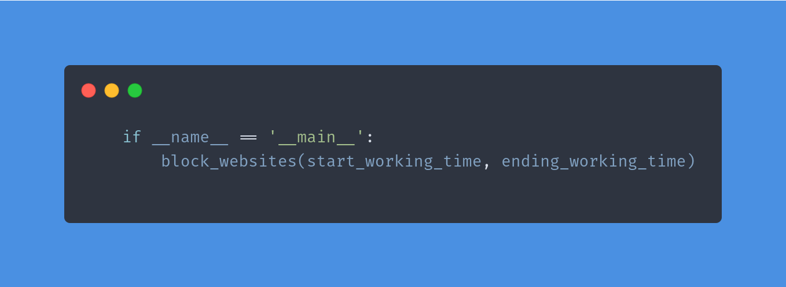

Вот немного улучшенная версия с добавлением смайликов и более привлекательным описанием:

# Website Blocker in Python 🚫💻

### Intro 👋  
----------------------
Hey there, everyone! 👋  

This repository contains the code for a simple **website blocker** project built with **Python** 🐍. It’s designed to help you block distracting websites during work hours to reduce distractions and boost productivity 📈💼.

### The Magic ✨  
-------------------
The magic behind this project is modifying the **host file** on your computer, which controls your access to the web 🌐. With this tool, you can focus on your work without distractions!

### Getting Started 🚀  
-----------------------
To get started with this project, simply clone the repository and edit the location of your **host file** depending on your operating system 🖥️.

### Adding Sites to Block + Editing Host Files 🔒  
--------------------------------------------------
Now, open **app.py**, go to line 4 where the `site_to_block` variable is located, and add the websites you want to block during your work time ⏰.

The script will automatically detect your operating system and update the **host file** accordingly. 🎩✨

### Setting Work Hours ⏳  
---------------------------
You’ll need to set the **start** and **end** working hours when you want to block access to those websites. To do this, go to the last line of the code and edit the hours accordingly.

### Congratulations! 🎉  
------------------------
Well done! You’ve now created a fully functioning **website blocker** to improve your productivity. All built with **Python**! 🐍💪

### Issues ❓  
----------------
If you run into any issues or difficulties while running the script, feel free to raise them in the **Issues** section! 🛠️

### Pull Requests 🤝  
---------------------
Got an improvement or feature in mind? Feel free to submit **Pull Requests**! I welcome contributions to make this project even better, and I’ll merge them as soon as possible. 🚀

### Give It a Star ✨  
---------------------
If you find this project useful, please give it a star ⭐ on GitHub! 🌟